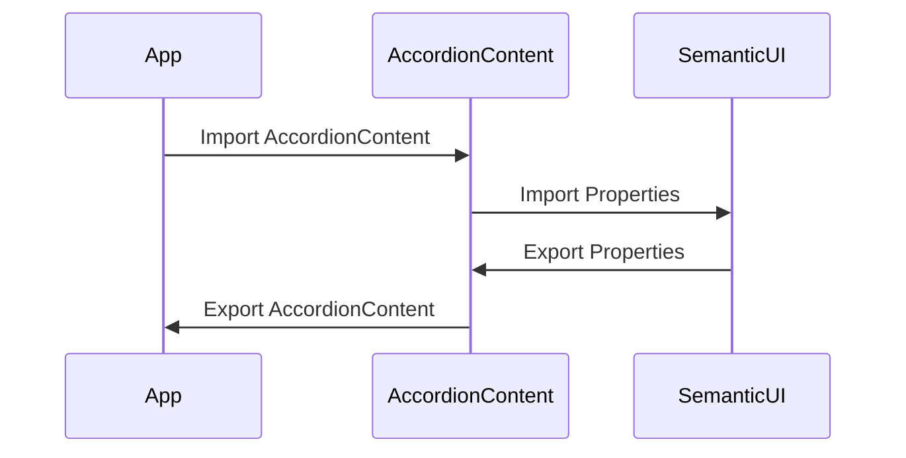

# AccordionContent Component

A re-usable custom component wrapper around [semantic-ui-react Accordion.Content](https://react.semantic-ui.com/modules/accordion), content sub-component of Accordion.

# Sequence Diagram

