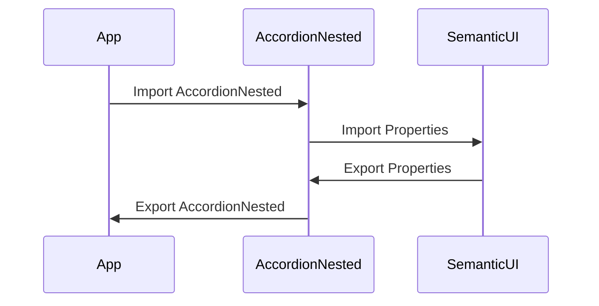

# AccordionNested Component

A re-usable custom component wrapper around [semantic-ui-react Accordion.Accordion](https://react.semantic-ui.com/modules/accordion), sub-component of Accordion.

# Sequence Diagram

