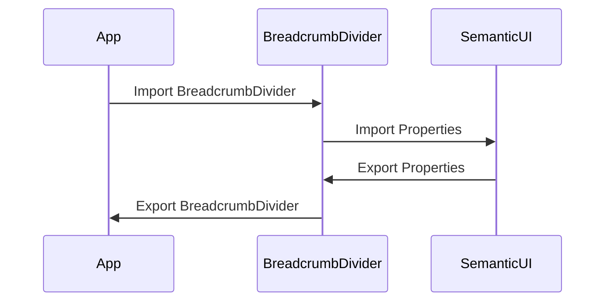

# BreadcrumbDivider Component

A re-usable custom component wrapper around [semantic-ui-react Breadcrumb.Divider](https://react.semantic-ui.com/collections/breadcrumb), divider sub-component of Breadcrumb.

# Sequence Diagram

