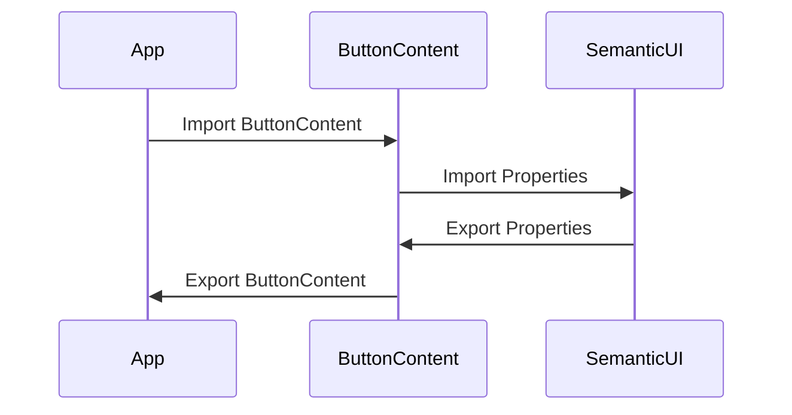

# ButtonContent Component

A re-usable custom component wrapper around [semantic-ui-react Button.Content](https://react.semantic-ui.com/elements/button), content sub-component of Button.

# Sequence Diagram

