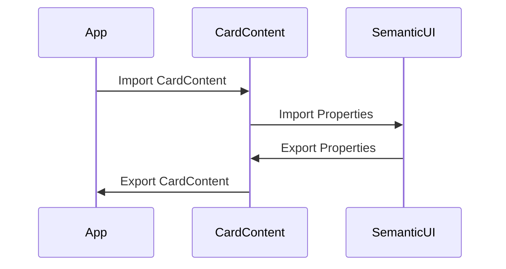

# CardContent Component

A re-usable custom component wrapper around [semantic-ui-react Card.Content](https://react.semantic-ui.com/views/card)

# Sequence Diagram

```mermaid
sequenceDiagram
participant App
participant CardContent
participant SemanticUI
    App ->> CardContent: Import CardContent;
    CardContent ->> SemanticUI : Import Properties
    SemanticUI ->> CardContent : Export Properties
    CardContent ->> App : Export CardContent
```
