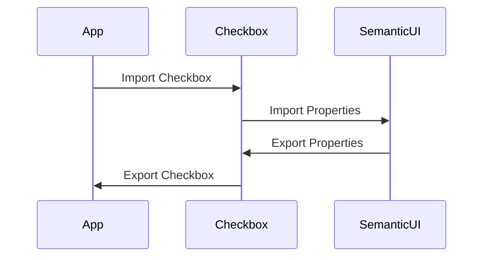

# Checkbox Component

A re-usable custom component wrapper around [semantic-ui-react Checkbox](https://react.semantic-ui.com/modules/checkbox)

# Sequence Diagram

```mermaid
sequenceDiagram
participant App
participant Checkbox
participant SemanticUI
    App ->> Checkbox: Import Checkbox;
    Checkbox ->> SemanticUI : Import Properties
    SemanticUI ->> Checkbox : Export Properties
    Checkbox ->> App : Export Checkbox
```
