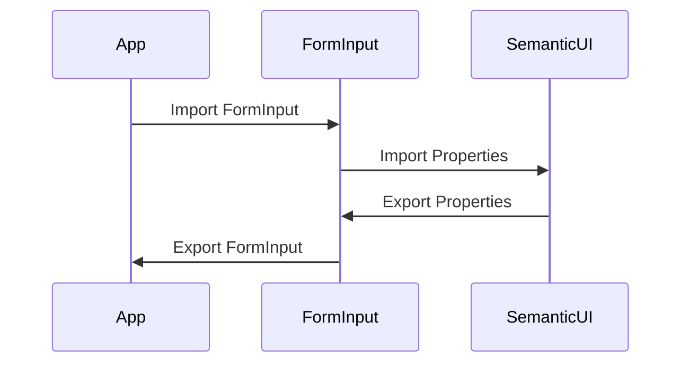

# FormInput Component

A re-usable custom component wrapper around [semantic-ui-react Form.Input](https://react.semantic-ui.com/collections/form)

# Sequence Diagram

```mermaid
sequenceDiagram
participant App
participant FormInput
participant SemanticUI
    App ->> FormInput: Import FormInput;
    FormInput ->> SemanticUI : Import Properties
    SemanticUI ->> FormInput : Export Properties
    FormInput ->> App : Export FormInput
```
