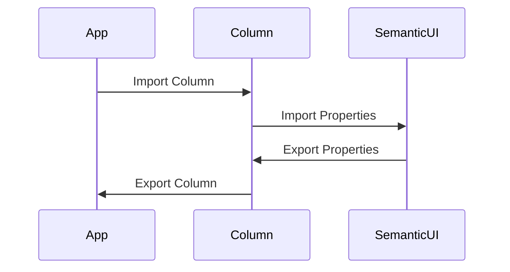

# Column Component

A re-usable custom component wrapper around [semantic-ui-react Grid.Column](https://react.semantic-ui.com/collections/grid)

# Sequence Diagram

```mermaid
sequenceDiagram
participant App
participant Column
participant SemanticUI
    App ->> Column: Import Column;
    Column ->> SemanticUI : Import Properties
    SemanticUI ->> Column : Export Properties
    Column ->> App : Export Column
```
