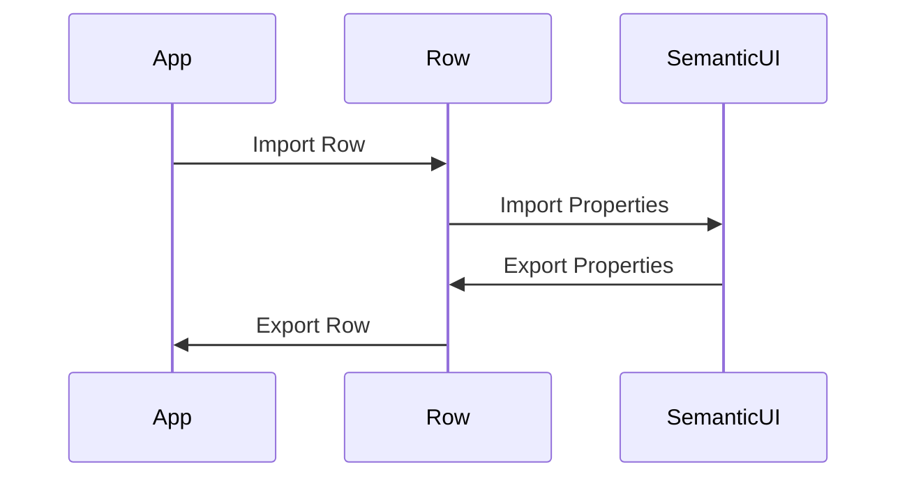

# Row Component

A re-usable custom component wrapper around [semantic-ui-react Grid.Row](https://react.semantic-ui.com/collections/grid)

# Sequence Diagram

```mermaid
sequenceDiagram
participant App
participant Row
participant SemanticUI
    App ->> Row: Import Row;
    Row ->> SemanticUI : Import Properties
    SemanticUI ->> Row : Export Properties
    Row ->> App : Export Row
```
