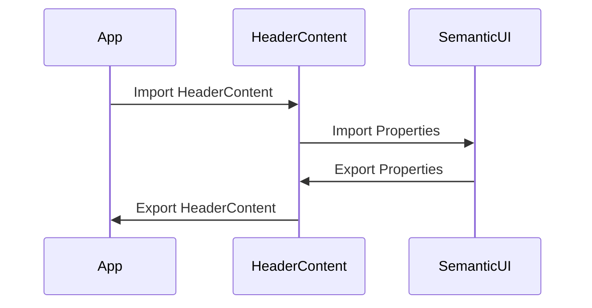

# HeaderContent Component

A re-usable custom component wrapper around [semantic-ui-react Header.Content](https://react.semantic-ui.com/elements/header)

# Sequence Diagram

```mermaid
sequenceDiagram
participant App
participant HeaderContent
participant SemanticUI
    App ->> HeaderContent: Import HeaderContent;
    HeaderContent ->> SemanticUI : Import Properties
    SemanticUI ->> HeaderContent : Export Properties
    HeaderContent ->> App : Export HeaderContent
```
