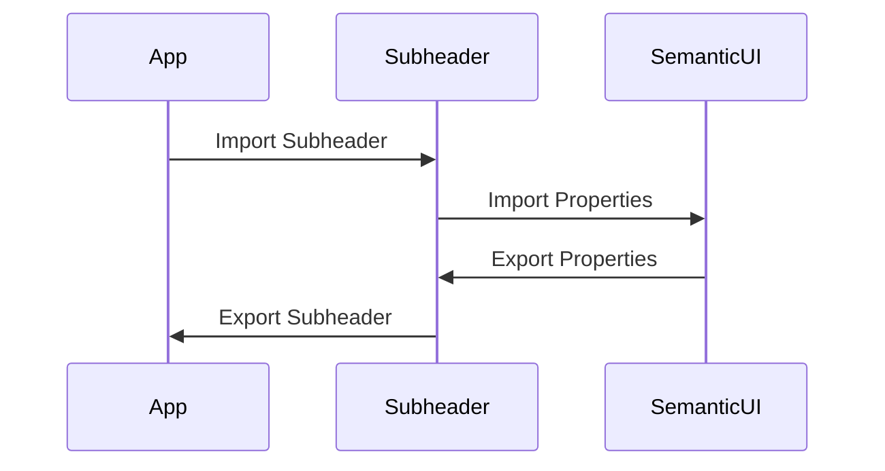

# Subheader Component

A re-usable custom component wrapper around [semantic-ui-react Header.Subheader](https://react.semantic-ui.com/elements/header)

# Sequence Diagram

```mermaid
sequenceDiagram
participant App
participant Subheader
participant SemanticUI
    App ->> Subheader: Import Subheader;
    Subheader ->> SemanticUI : Import Properties
    SemanticUI ->> Subheader : Export Properties
    Subheader ->> App : Export Subheader
```
