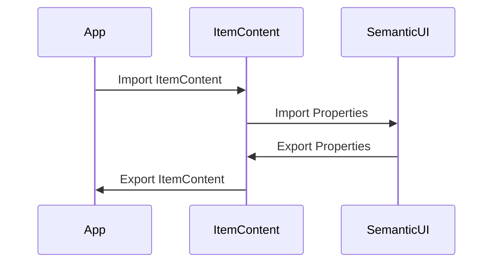

# ItemContent Component

A re-usable custom component wrapper around [semantic-ui-react Item.Content](https://react.semantic-ui.com/views/item)

# Sequence Diagram

```mermaid
sequenceDiagram
participant App
participant ItemContent
participant SemanticUI
    App ->> ItemContent: Import ItemContent;
    ItemContent ->> SemanticUI : Import Properties
    SemanticUI ->> ItemContent : Export Properties
    ItemContent ->> App : Export ItemContent
```
