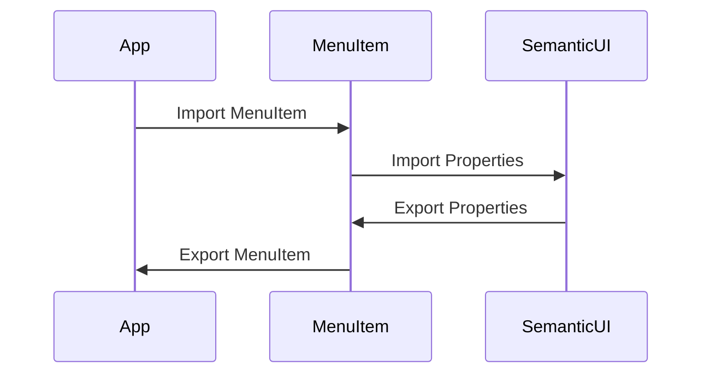

# MenuItem Component

A re-usable custom component wrapper around [semantic-ui-react Menu.Item](https://react.semantic-ui.com/collections/menu)

# Sequence Diagram

```mermaid
sequenceDiagram
participant App
participant MenuItem
participant SemanticUI
    App ->> MenuItem: Import MenuItem;
    MenuItem ->> SemanticUI : Import Properties
    SemanticUI ->> MenuItem : Export Properties
    MenuItem ->> App : Export MenuItem
```
