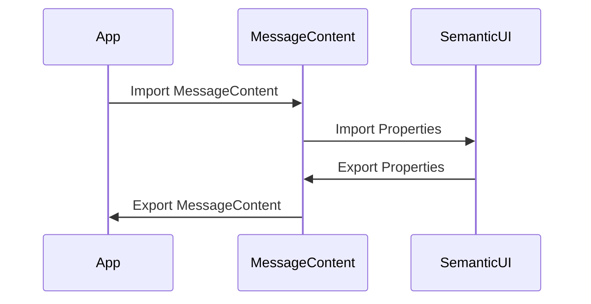

# MessageContent Component

A re-usable custom component wrapper around [semantic-ui-react Message.Content](https://react.semantic-ui.com/collections/message)

# Sequence Diagram

```mermaid
sequenceDiagram
participant App
participant MessageContent
participant SemanticUI
    App ->> MessageContent: Import MessageContent;
    MessageContent ->> SemanticUI : Import Properties
    SemanticUI ->> MessageContent : Export Properties
    MessageContent ->> App : Export MessageContent
```
