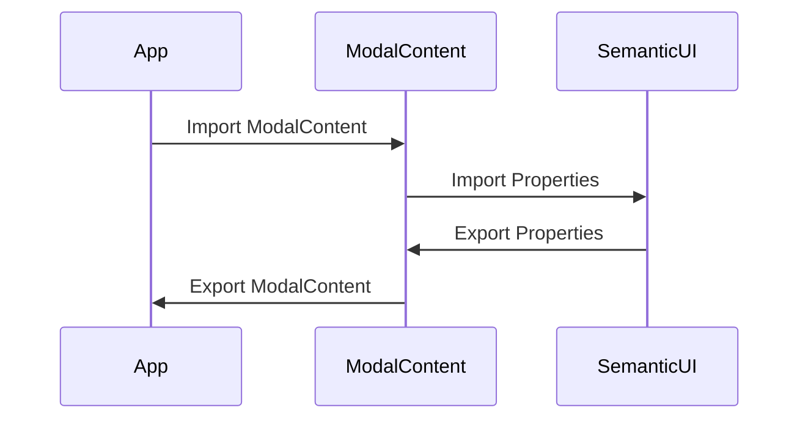

# ModalContent Component

A re-usable custom component wrapper around [semantic-ui-react Modal.Content](https://react.semantic-ui.com/modules/modal)

# Sequence Diagram

```mermaid
sequenceDiagram
participant App
participant ModalContent
participant SemanticUI
    App ->> ModalContent: Import ModalContent;
    ModalContent ->> SemanticUI : Import Properties
    SemanticUI ->> ModalContent : Export Properties
    ModalContent ->> App : Export ModalContent
```
