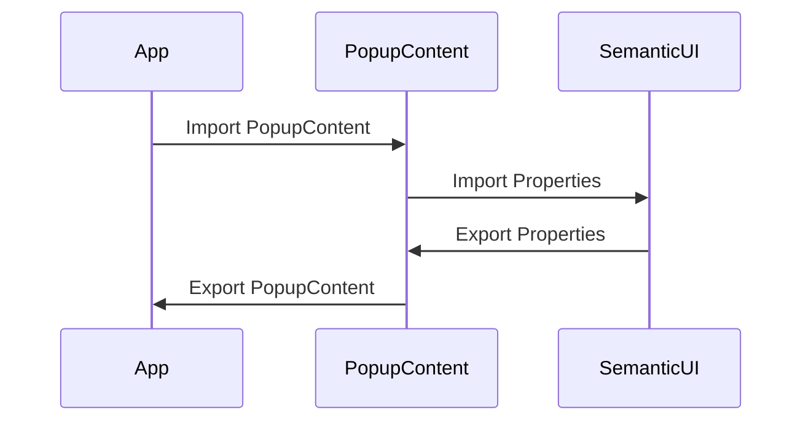

# PopupContent Component

A re-usable custom component wrapper around [semantic-ui-react Popup.Content](https://react.semantic-ui.com/modules/popup)

# Sequence Diagram

```mermaid
sequenceDiagram
participant App
participant PopupContent
participant SemanticUI
    App ->> PopupContent: Import PopupContent;
    PopupContent ->> SemanticUI : Import Properties
    SemanticUI ->> PopupContent : Export Properties
    PopupContent ->> App : Export PopupContent
```
