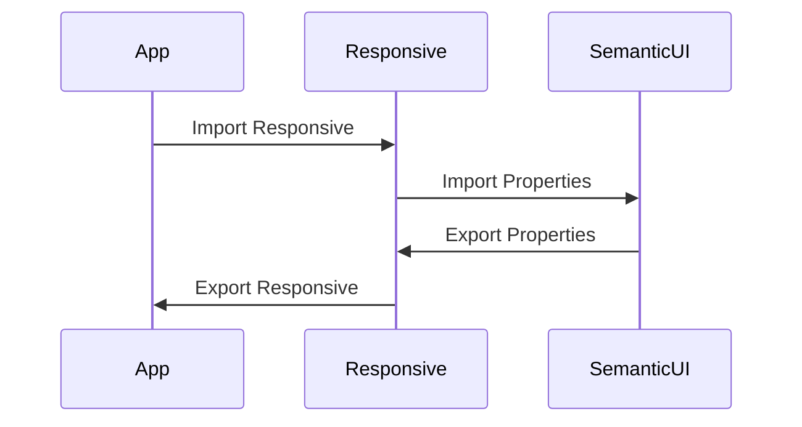

# Responsive Component

A re-usable custom component wrapper around [semantic-ui-react Responsive](https://react.semantic-ui.com/addons/responsive)

# Sequence Diagram

```mermaid
sequenceDiagram
participant App
participant Responsive
participant SemanticUI
    App ->> Responsive: Import Responsive;
    Responsive ->> SemanticUI : Import Properties
    SemanticUI ->> Responsive : Export Properties
    Responsive ->> App : Export Responsive
```
