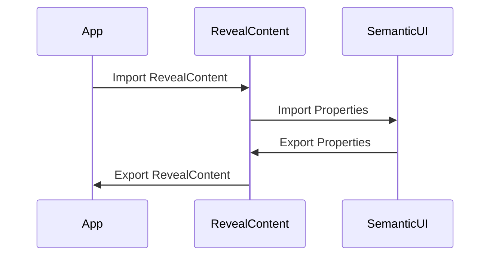

# RevealContent Component

A re-usable custom component wrapper around [semantic-ui-react Reveal.Content](https://react.semantic-ui.com/elements/reveal)

# Sequence Diagram

```mermaid
sequenceDiagram
participant App
participant RevealContent
participant SemanticUI
    App ->> RevealContent: Import RevealContent;
    RevealContent ->> SemanticUI : Import Properties
    SemanticUI ->> RevealContent : Export Properties
    RevealContent ->> App : Export RevealContent
```
