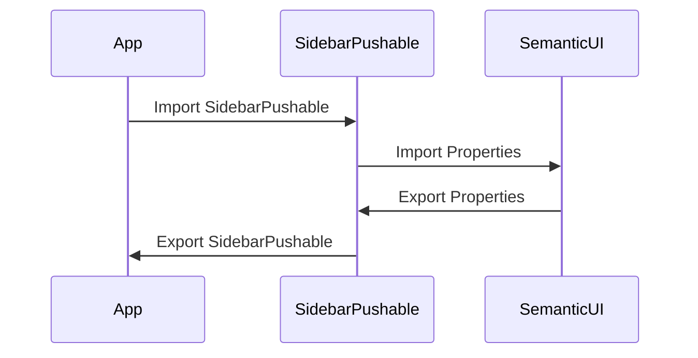

# SidebarPushable Component

A re-usable custom component wrapper around [semantic-ui-react Sidebar.Pushable](https://react.semantic-ui.com/modules/sidebar)

# Sequence Diagram

```mermaid
sequenceDiagram
participant App
participant SidebarPushable
participant SemanticUI
    App ->> SidebarPushable: Import SidebarPushable;
    SidebarPushable ->> SemanticUI : Import Properties
    SemanticUI ->> SidebarPushable : Export Properties
    SidebarPushable ->> App : Export SidebarPushable
```
