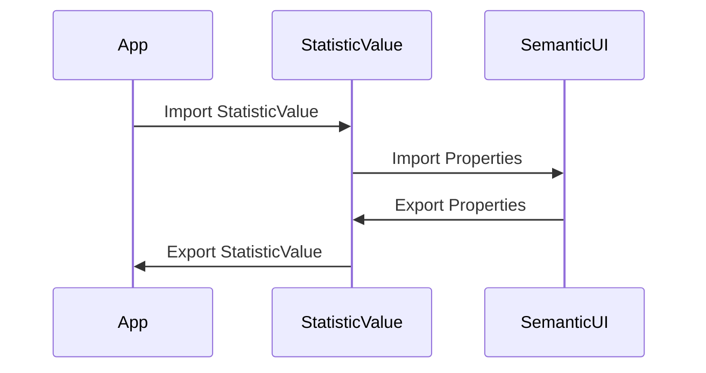

# StatisticValue Component

A re-usable custom component wrapper around [semantic-ui-react Statistic.Value](https://react.semantic-ui.com/views/statistic)

# Sequence Diagram

```mermaid
sequenceDiagram
participant App
participant StatisticValue
participant SemanticUI
    App ->> StatisticValue: Import StatisticValue;
    StatisticValue ->> SemanticUI : Import Properties
    SemanticUI ->> StatisticValue : Export Properties
    StatisticValue ->> App : Export StatisticValue
```
