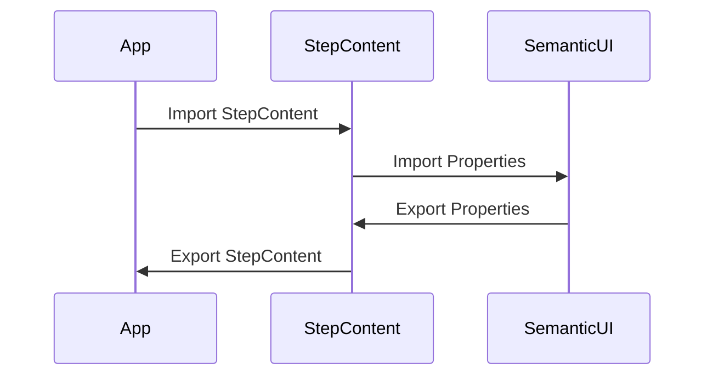

# StepContent Component

A re-usable custom component wrapper around [semantic-ui-react Step.Content](https://react.semantic-ui.com/elements/step)

# Sequence Diagram

```mermaid
sequenceDiagram
participant App
participant StepContent
participant SemanticUI
    App ->> StepContent: Import StepContent;
    StepContent ->> SemanticUI : Import Properties
    SemanticUI ->> StepContent : Export Properties
    StepContent ->> App : Export StepContent
```
