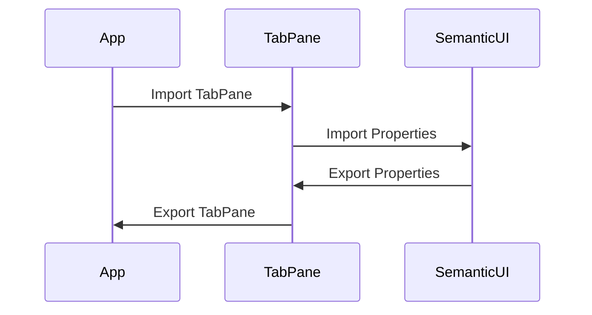

# TabPane Component

A re-usable custom component wrapper around [semantic-ui-react Tab.Pane](https://react.semantic-ui.com/modules/tab)

# Sequence Diagram

```mermaid
sequenceDiagram
participant App
participant TabPane
participant SemanticUI
    App ->> TabPane: Import TabPane;
    TabPane ->> SemanticUI : Import Properties
    SemanticUI ->> TabPane : Export Properties
    TabPane ->> App : Export TabPane
```
