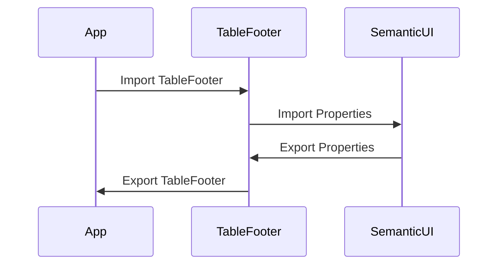

# TableFooter Component

A re-usable custom component wrapper around [semantic-ui-react Table.Footer](https://react.semantic-ui.com/collections/table)

# Sequence Diagram

```mermaid
sequenceDiagram
participant App
participant TableFooter
participant SemanticUI
    App ->> TableFooter: Import TableFooter;
    TableFooter ->> SemanticUI : Import Properties
    SemanticUI ->> TableFooter : Export Properties
    TableFooter ->> App : Export TableFooter
```
